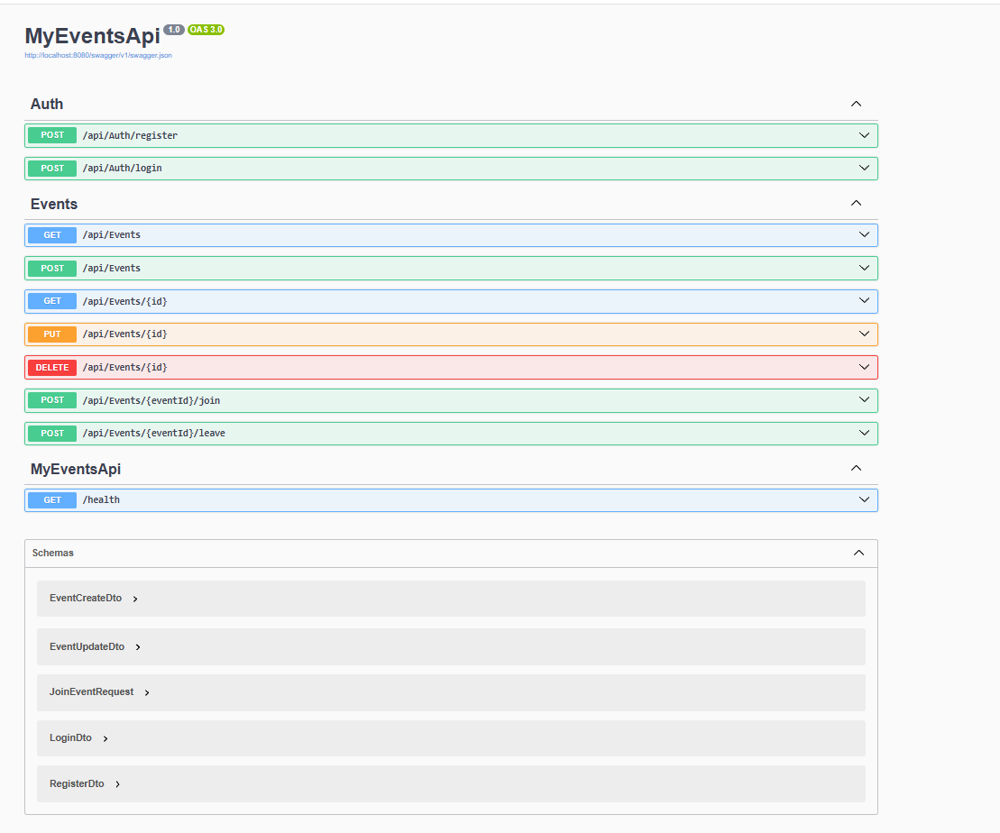

# 🎯 MyEventsApi (.NET 8 Web API)



**MyEventsApi** — це REST API для керування подіями: користувачі можуть створювати, редагувати, приєднуватись або залишати події.  
Система побудована на **.NET 8**, використовує **Entity Framework Core**, **JWT авторизацію** та **PostgreSQL** у Docker-середовищі.

---


## 🚀 Швидкий запуск

```bash

docker compose up --build

🔗 Swagger UI: http://localhost:8080/swagger

---

⚙️ Основні можливості

🔐 JWT Auth — реєстрація, логін, авторизація

📅 Events CRUD — створення, редагування, видалення подій

🙋 Join / Leave — користувачі можуть приєднуватися до подій

🐳 Docker + PostgreSQL — повна ізоляція середовища

🧩 Health-check — для моніторингу стану API

---

🧠 Використані технології

ASP.NET Core 8

Entity Framework Core + PostgreSQL

JWT (JSON Web Tokens)

Docker & Docker Compose

Swagger (OpenAPI)

---

📁 Структура проекту
	
Controllers/   →  AuthController, EventsController

Models/        →  User, Event, Participant

Data/          →  ApplicationDbContext (EF Core)

Dtos/          →  DTOs для запитів/відповідей

Migrations/    →  EF Core міграції